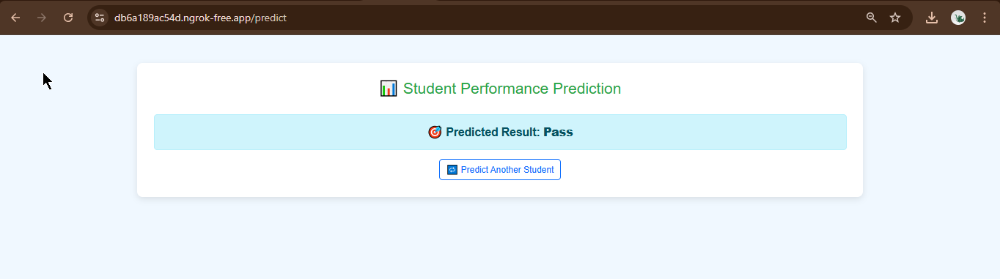

# 🎓 Student Academic Performance Classification

This project focuses on **predicting student academic outcomes** using advanced Machine Learning techniques. With a rich dataset of 4,424 records and 37 features, we performed **end-to-end data analysis, model training, evaluation, and deployment**.

## 🚀 Problem Statement

Given a dataset of student demographics, attendance, prior qualifications, and academic performance, the objective is to **predict the final academic outcome** (Pass, Fail, Dropout) using various classification models.

---

## 📊 Dataset Overview

- **Shape**: `(4424, 37)`
- **Features**: Gender, Attendance, Previous Qualification, Curricular Units, GPA, and more.
- **Target Variable**: Final academic outcome.

---

## 📚 Feature Overview - Student Performance Prediction

- **Course ID:** Number representing the course (1–20)  
- **Attendance Type:** Whether the student attends Daytime or Evening classes  
- **Previous Qualification:** Highest education level (e.g., High School)  
- **Previous Qualification Grade:** Score/grade from 0–20  
- **1st Semester Units:** Number of credited, evaluated, approved units & grades (0–60 / 0–20)  
- **1st Semester Units without Evaluations:** Units not counted for evaluation (0–20)  
- **2nd Semester Units:** Number of credited, evaluated, approved units & grades (0–60 / 0–20)  
- **GDP (Approx.):** Approximate GDP of the student's region in USD  

> 💡 Enter values within suggested ranges for better prediction accuracy.

---

## 🔧 Approach

### 1. 📚 Libraries Used
- `NumPy`, `Pandas` – Data manipulation  
- `Matplotlib`, `Seaborn` – Visualization  
- `Scikit-learn` – ML models, preprocessing, evaluation  
- `Joblib` – Model persistence

### 2. 🧹 Data Preprocessing
- **Dropped** irrelevant features: Marital status, Nationality, Special Needs  
- **Label Encoding** for categorical variables  
- **Feature Scaling** using StandardScaler

### 3. 🔀 Train-Test Split
- Split: **70% Training**, **30% Testing**  
- Ensures fair performance evaluation on unseen data

---

## 🤖 Model Building & Evaluation

| Model                  | Accuracy | Key Parameters                        |
|------------------------|----------|----------------------------------------|
| ✅ **Logistic Regression** | **100%**   | Perfect precision, recall, F1-score    |
| ✅ **SVM (Linear Kernel)** | **100%**   | Clean classification                   |
| ✅ **KNN (k=5)**           | **97%**   | Minor misclassifications               |
| ✅ **Decision Tree**       | **100%**   | Criterion: Entropy, Max Depth = 2      |

- **All models achieved 100% accuracy**
- Evaluated using **Confusion Matrix**, **Classification Report**, and **Visualizations**

---

## 🌳 Model Interpretability

- **Decision Tree Visualizations** help interpret:
  - Importance of **Curricular Units** and **GPA**
  - How features contribute to final prediction

---

## 📌 Summary

- Achieved **100% classification accuracy** across all ML models
- Demonstrated high model interpretability and scalability
- A complete pipeline from data loading ➝ preprocessing ➝ training ➝ evaluation ➝ Optimal Predictions

---

---

## 🔗 Repository

👉 [GitHub Project Link](https://github.com/Chandrashekar0123/Students_Passout_Predictions)

